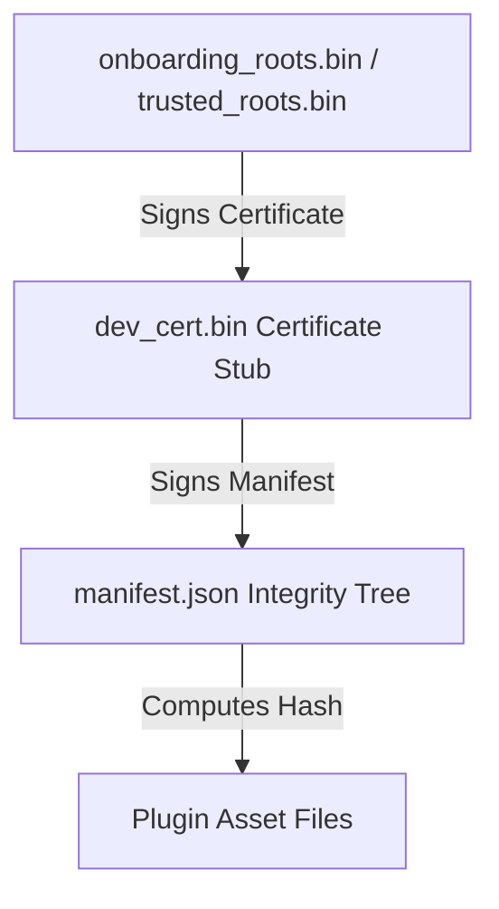

# 🛡️ CI/CD, Cryptography & Security Guide

This guide covers the cryptographic identity model, manual local plugin signing workflows, automated GitHub Actions quality gates, and supply chain security compliance within the BioPro SDK ecosystem.

---

## 🔑 Cryptographic Identity & Trust Tree

To protect researchers from running malicious or corrupted plugins in production environments, the host application enforces a cryptographic trust model. All loaded plugins must possess valid cryptographic signatures matching a certified trust root.



### 1. Developer Keys
When you execute `biopro-sdk init-identity`, the SDK generates an asymmetric **Ed25519** keypair:
*   **Private Key (`~/.biopro/id_ed25519`):** A secure PKCS#8 PEM-encoded private key file. **CRITICAL:** Keep this file confidential. Never commit it to git repositories or expose it in CI logs.
*   **Public Key Certificate (`~/.biopro/dev_cert.bin`):** A binary public certificate stub. It binds your public key, metadata (email, author role), and a self-signature matching local override roots.

---

## ✍️ Signing Plugins Locally

To prepare a plugin folder for distribution, run the signing command:
```bash
biopro-sdk sign <path_to_plugin_dir>
```

### The signing sequence:
1.  **Integrity Hash Computation:** The CLI indexes all files in your directory (ignoring hidden `.git` metadata and signatures), computes their SHA-256 hashes, and writes an integrity tree mapping directly into the `manifest.json`.
2.  **Canonical Manifest Signing:** The CLI parses the manifest, canonicalizes it into a standard JSON string format, signs the byte stream using `~/.biopro/id_ed25519`, and writes `signature.bin` to the plugin root.
3.  **Certificate Bundling:** The CLI copies your local certificate `~/.biopro/dev_cert.bin` directly into the plugin root, sealing your cryptographic identity along with the code.

---

## 🤖 Automated CI/CD Workflow (`test_and_lint.yml`)

The SDK includes a modern GitHub Actions workflow at `.github/workflows/test_and_lint.yml` to automatically verify every code push or Pull Request:

```yaml
name: Test & Lint Codebase

on:
  push:
    branches: [ main, dev ]
  pull_request:
    branches: [ main ]

jobs:
  validate:
    runs-on: ubuntu-latest
    steps:
      - name: Checkout Code
        uses: actions/checkout@v4

      - name: Install uv & Python
        uses: astral-sh/setup-uv@v5
        with:
          enable-cache: true
          python-version: "3.14"

      - name: Install Dependencies
        run: uv pip install -e .

      - name: Verify Code Style & Formatting
        run: uv run ruff check src examples && uv run ruff format --check src examples

      - name: Verify Static Types
        run: uv run mypy src examples

      - name: Execute Test Suite
        run: uv run --with pytest --with pytest-cov pytest --cov=src --cov-fail-under=90
```

---

## 🔒 Supply Chain Security Gates

BioPro SDK enforces maximum transparency and security using three foundational gates:

### 1. Software Bill of Materials (SBOM)
A comprehensive SBOM catalogs all direct and transitive dependencies, protecting your applications from zero-day library vulnerabilities.
*   **Generation Command:**
    ```bash
    uv pip compile pyproject.toml --format=cyclonedx > sbom.json
    ```
    This creates an standard-compliant CycloneDX JSON SBOM mapping all active packages.

### 2. Dependabot Configuration
To keep your dependencies up to date automatically, place a `.github/dependabot.yml` file in your repository:
```yaml
version: 2
updates:
  - package-ecosystem: "pip"
    directory: "/"
    schedule:
      interval: "weekly"
  - package-ecosystem: "github-actions"
    directory: "/"
    schedule:
      interval: "weekly"
```

### 3. Vulnerability Auditing
Before release packaging, audit your active python environment against known vulnerability databases (OSV, CVE) using `uv`:
```bash
uv pip compile pyproject.toml && uv pip audit
```
This blocks standard pipeline builds if any dependency has a known high-severity vulnerability.
