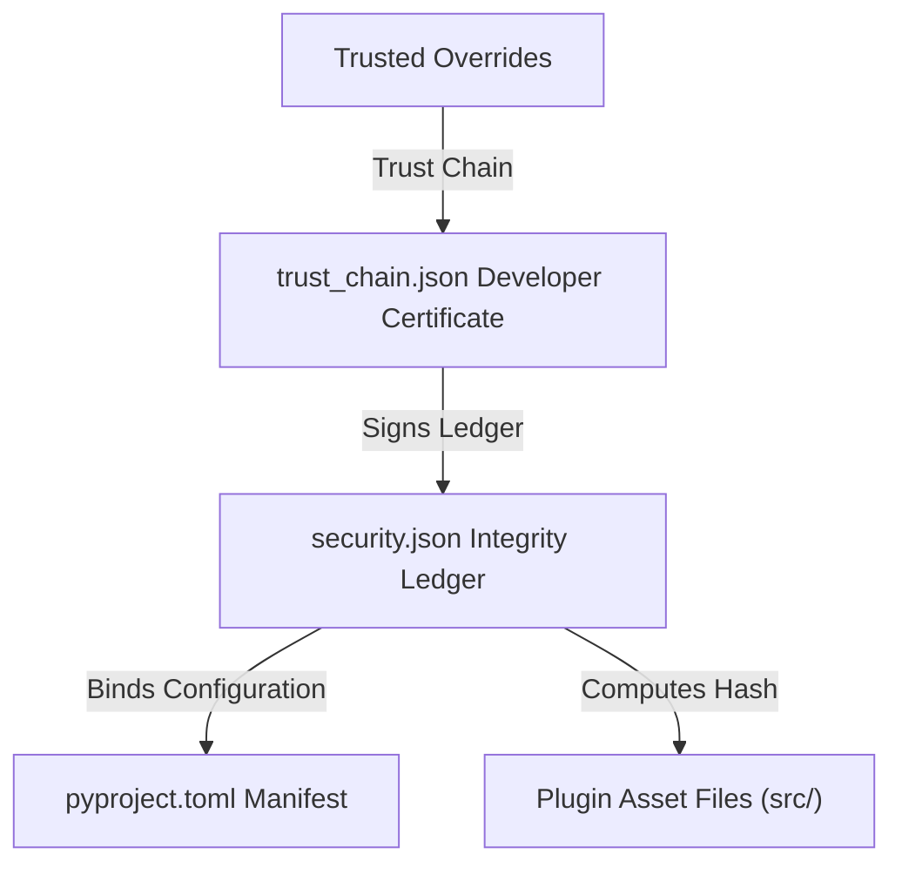

# 🛡️ CI/CD, Cryptography & Security Guide

This guide covers the cryptographic identity model, manual local plugin signing workflows, automated GitHub Actions quality gates, and supply chain security compliance within the Karcytics SDK ecosystem.

---

## 🔑 Cryptographic Identity & Trust Tree

To protect researchers from running malicious or corrupted plugins in production environments, the host application enforces a cryptographic trust model. All loaded plugins must possess valid cryptographic signatures matching a certified trust root.


```mermaid
graph TD
    Root["Trusted Overrides"] -->|Trust Chain| Cert["trust_chain.json Developer Certificate"]
    Cert -->|Signs Ledger| Security["security.json Integrity Ledger"]
    Security -->|Binds Configuration| Manifest["pyproject.toml Manifest"]
    Security -->|Computes Hash| Asset["Plugin Asset Files (src/)"]
```

### 1. Developer Keys
When you execute `karcytics-sdk init-identity`, the SDK generates an asymmetric **Ed25519** keypair:
*   **Private Key (`~/.karcytics/dev_keys/private.key`):** A secure PKCS#8 PEM-encoded private key file. **CRITICAL:** Keep this file confidential. Never commit it to git repositories or expose it in CI logs.
*   **Public Key Certificate (`~/.karcytics/dev_keys/public.pub`):** A public certificate stub. It establishes your developer identity for subsequent signing operations.

---

## ✍️ Signing Plugins Locally

To prepare a plugin folder for distribution, run the signing command:
```bash
karcytics-sdk sign <path_to_plugin_dir>
```

### The signing sequence:
1.  **Integrity Hash Computation:** The CLI indexes all files in your `src/` directory, computes their SHA-256 hashes, and writes them into `security.json`, along with the hash of `pyproject.toml`.
2.  **Ledger Signing:** The CLI signs the `security.json` bytes using your developer private key (`~/.karcytics/dev_keys/private.key`), and writes `signature.bin` to the plugin root.
3.  **Trust Chain Bundling:** The CLI bundles your developer public key into a `trust_chain.json` file inside the plugin root to establish cryptographic identity.

---

## 🤖 Automated CI/CD Workflows (GitHub Actions)

When you run `karcytics-sdk bootstrap <plugin_dir>`, the SDK automatically generates three best-practice GitHub Actions workflows in `.github/workflows/` to automate your CI/CD pipeline:

### 1. `ci.yml` (Tests & Linting)
Runs automatically on every push or Pull Request to `main` or `develop`.
- Installs `uv` and provisions a clean Python environment.
- Executes `ruff check` for lightning-fast code style validation.
- Runs `pytest` against your `tests/` directory natively using `uv sync` and virtual environments.

### 2. `deploy-docs.yml` (Documentation)
Runs on pushes to `main` (or manually).
- Installs `mkdocs-material` via `uv pip`.
- Builds your static documentation from the `docs/` folder.
- Deploys the built site to GitHub Pages automatically.

### 3. `release.yml` (Auto-Release & Registry)
Runs automatically when code is pushed to `main` with a bumped version in `pyproject.toml`.
- Detects new versions using a lightweight `tomllib` parser.
- Tags the repository and executes `karcytics-sdk evaluate` and `karcytics-sdk project-sign`.
- Bundles the plugin into a production-ready `.zip` archive (excluding tests, venvs, and Git history).
- Creates a GitHub Release with auto-generated release notes.
- Automatically opens a Pull Request on the central `Karcytics-Distribution` repository to update the `registry.json` ledger.


---

## 🔒 Supply Chain Security Gates

Karcytics SDK enforces maximum transparency and security using three foundational gates:

### 1. Software Bill of Materials (SBOM)
A comprehensive SBOM catalogs all direct and transitive dependencies, protecting your applications from zero-day library vulnerabilities.
*   **Generation Command:**
    ```bash
    uv pip compile pyproject.toml --format=cyclonedx > sbom.json
    ```
    This creates an standard-compliant CycloneDX JSON SBOM mapping all active packages.

### 2. Dependabot Configuration
To keep your dependencies up to date automatically, place a `.github/dependabot.yml` file in your repository:
```yaml
version: 2
updates:
  - package-ecosystem: "pip"
    directory: "/"
    schedule:
      interval: "weekly"
  - package-ecosystem: "github-actions"
    directory: "/"
    schedule:
      interval: "weekly"
```

### 3. Vulnerability Auditing
Before release packaging, audit your active python environment against known vulnerability databases (OSV, CVE) using `uv`:
```bash
uv pip compile pyproject.toml && uv pip audit
```
This blocks standard pipeline builds if any dependency has a known high-severity vulnerability.
