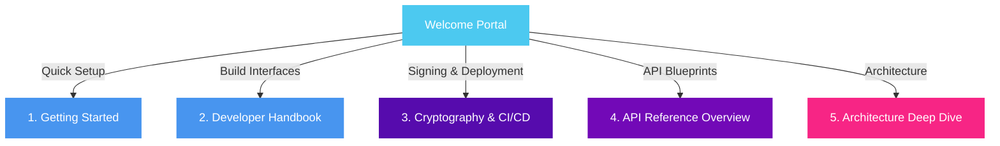

# 🧬 BioPro SDK: Developer Portal

Welcome to the official developer portal and documentation site for the **BioPro Software Development Kit (SDK)**! 

BioPro SDK is a state-of-the-art, high-performance Python framework designed to build secure, multi-threaded, and theme-compliant scientific analysis plugins. It is engineered with robust cryptographic trust controls, decoupled UI/engine execution boundaries, and seamless thread pool delegation.

---

## 🏛️ Codebase Map: What is Where?

A developer looking at the repository files should be able to navigate instantly. Here is a comprehensive breakdown of the file system and module layout:

```text
biopro-sdk/
├── src/                          # Main source files
│   └── biopro_sdk/
│       ├── plugin/               # Foundation for plugin developers
│       │   ├── base.py           # Core PluginBase and PluginState definitions
│       │   ├── components.py     # Custom semantic UI buttons and cards
│       │   ├── dialogs.py        # Themed dialog prompts and input wrappers
│       │   ├── wizard.py         # Multi-step guided wizard framework
│       │   ├── analysis.py       # Non-blocking AnalysisBase background thread interfaces
│       │   ├── logging.py        # Injected PluginLoggerAdapter console loggers
│       │   ├── io.py             # Persistent JSON configurations (PluginConfig)
│       │   └── preferences.py    # PreferenceManagerProtocol abstractions
│       │
│       ├── host/                 # Host Application Integrations & Security
│       │   ├── trust_manager.py  # Standard-based signature verification engine
│       │   ├── trust_overrides.py# Silently signed local user trust registries
│       │   ├── trust_path.py     # Structured manifest path serializations
│       │   ├── docs.py           # Programmatic API documentation indices
│       │   └── ai.py             # AI Assistants and inference endpoints
│       │
│       └── sdk_cli.py            # Argparse Unified CLI (Identity manager, signing, shims)
│
├── examples/                     # Production-grade Sandbox Blueprints
│   ├── hello_world/              # Minimal panel, semantic components, and status alerts
│   ├── background_task/          # Multi-threaded calculations using QThreadPool and progress bars
│   └── themed_wizard/            # Dynamic guided setup forms, local configs, and theme adapters
│
├── tests/                        # Comprehensive Headless testing suite
│   ├── conftest.py               # Shared QApplication event loops and fixtures
│   ├── test_plugin_state.py      # Assertions for state captures and undo history
│   ├── test_ui_components.py     # Graphic interactions and semantic layouts
│   └── ...
│
└── docs/                         # Structured developer handbook files
```

---

## 🗺️ Visual Documentation Roadmap

To get started quickly, follow these curated pathways:



### 🧭 Navigating the Pillars:

1.  **🏁 [Getting Started](Getting_Started.md):** Learn how to prepare your local virtual environment using `uv`, generate onboarding keys, and construct your first signed hello world plugin.
2.  **📖 [Developer Handbook](Dev_Handbook.md):** Deep technical workflows on layouts, dynamic state binding, persistent local storage, and the PyQt6 event model.
3.  **🛡️ [CI/CD & Security](CI_CD_Guide.md):** Learn how the BioPro security model signs code, performs integrity checks, and integrates into GitHub Actions workflows.
4.  **🔍 [API Reference Index](API_Reference.md):** Comprehensive technical references for all submodules:
    *   **[Core Plugin interfaces](API_Plugin_Base.md):** `PluginBase` and `PluginState`.
    *   **[UI Toolkit](API_UI_Components.md):** Semantic buttons, wizards, and theme manager adapters.
    *   **[Background Concurrency](API_Background_Engine.md):** `AnalysisBase` and multi-threaded signals.
    *   **[Security Cryptography](API_Trust_Cryptography.md):** `TrustManager` and onboarding loaders.
5.  **🧠 [Architectural Design](Architectural_Design.md):** Deep dive into the architectural principles (RAII cleanup, DIP preferences, headless QTest event orchestration).
